# StockSense AI -- Backend Workflow Technical Documentation

| Field | Details |
|---|---|
| **Project** | StockSense AI -- AI-Powered Supply Chain & Inventory Intelligence System |
| **Version** | 1.0 |
| **Date** | March 15, 2026 |
| **Author** | Vyshakh Vijayan |
| **Backend Platform** | n8n Workflow Automation |
| **Database** | PostgreSQL (Supabase) |
| **AI Provider** | Groq -- Llama 3.1 8B Instant |

---

## Table of Contents

- [1. System Overview](#1-system-overview)
  - [1.1 Architecture](#11-architecture)
  - [1.2 Workflow Summary](#12-workflow-summary)
  - [1.3 Daily Pipeline Execution Order](#13-daily-pipeline-execution-order)
  - [1.4 Database Tables](#14-database-tables)
- [2. WF-01: Product & Sales Data Ingestion](#2-wf-01-product--sales-data-ingestion)
- [3. WF-02: Stockout Date Calculator](#3-wf-02-stockout-date-calculator)
- [4. WF-03: Inventory Processing & Stock Alerts](#4-wf-03-inventory-processing--stock-alerts)
- [5. WF-04: Stock Risk Classification](#5-wf-04-stock-risk-classification)
- [6. WF-05: AI Reorder Intelligence](#6-wf-05-ai-reorder-intelligence)
- [7. WF-06: Supplier Scoring](#7-wf-06-supplier-scoring)
- [8. WF-07: WhatsApp Alert Sender](#8-wf-07-whatsapp-alert-sender)
- [9. WF-08: Daily Orchestrator](#9-wf-08-daily-orchestrator)
- [10. Cross-Workflow Dependencies](#10-cross-workflow-dependencies)
- [11. Database Reference](#11-database-reference)
- [12. Appendices](#12-appendices)

---

## 1. System Overview

### 1.1 Architecture

StockSense AI uses **n8n** as its backend automation engine. There is no traditional server-side code -- all business logic runs as n8n workflows that interact with a **Supabase PostgreSQL** database and external APIs (Groq LLM, Twilio WhatsApp). The React frontend communicates with n8n via **webhooks** and reads data directly from Supabase.

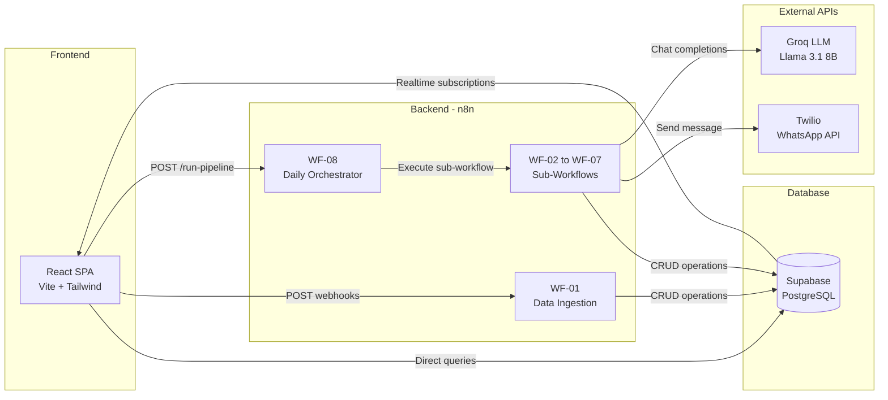

### 1.2 Workflow Summary

| # | Workflow | ID | Trigger | Nodes | Purpose |
|---|---|---|---|---|---|
| 01 | Product & Sales Data Ingestion | `bMJ_c4ogbOgNfObNKpbuE` | POST webhook | 8 | Upsert product data from frontend |
| 02 | Stockout Date Calculator | `JgDNR0tDWj0Z_DVfHB4Fo` | Sub-workflow / Manual | 5 | Calculate days to stockout |
| 03 | Inventory Processing & Stock Alerts | `P_JZINAHgGw-IVQOjI4eg` | Sub-workflow / Manual | 7 | Generate low-stock alerts |
| 04 | Stock Risk Classification | `VkFbE0ZONeTximBLOw5Wx` | Sub-workflow / Manual | 5 | Classify products by risk tier |
| 05 | AI Reorder Intelligence | `ivm5yQJMfSZn0VrNt40RB` | Sub-workflow / Manual | 11 | AI-powered reorder suggestions |
| 06 | Supplier Scoring | `WkRvETkpAySDKEAzPwRWi` | Sub-workflow / Manual | 5 | Score and grade suppliers |
| 07 | WhatsApp Alert Sender | `C_-48mOxTzD9s-2H8UBT8` | POST webhook / Sub-workflow | 6 | Send WhatsApp stock alerts |
| 08 | Daily Orchestrator | `YGmf1h03MCjFVIMU3q0Zn` | Schedule (8 AM) / POST webhook | 21 | Master pipeline orchestrator |

### 1.3 Daily Pipeline Execution Order

Every day at 8:00 AM (or on-demand via webhook), WF-08 orchestrates the entire system:

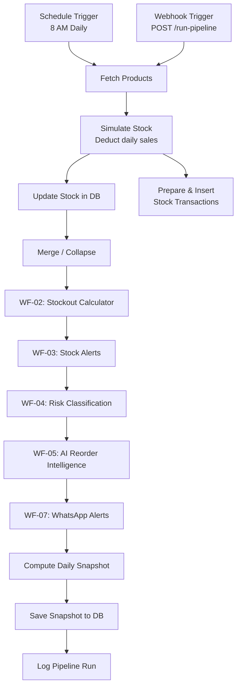

### 1.4 Database Tables

The workflows interact with 8 Supabase PostgreSQL tables:

| Table | Written By | Read By | Purpose |
|---|---|---|---|
| `Products` | WF-01, WF-02, WF-04, WF-08 | WF-02, WF-03, WF-04, WF-05, WF-08 | Master product catalog |
| `Suppliers` | WF-06 | WF-05, WF-06 | Supplier directory with scores |
| `Stock Alerts` | WF-03 | WF-07 | Low-stock alert records |
| `Reorder Suggestions` | WF-05 | -- | AI-generated reorder recommendations |
| `Stock Transactions` | WF-08 | -- | Immutable stock change ledger |
| `Daily Snapshots` | WF-08 | -- | Daily health score snapshots |
| `System Logs` | WF-08 | -- | Pipeline execution logs |
| `Store Profiles` | -- | -- | Store configuration (auth-linked) |

---

## 2. WF-01: Product & Sales Data Ingestion

> **ID:** `bMJ_c4ogbOgNfObNKpbuE` | **Nodes:** 8 | **Trigger:** POST Webhook

### Screenshot

> *Add a screenshot of WF-01 from the n8n editor here.*
>
> 

### Workflow Diagram

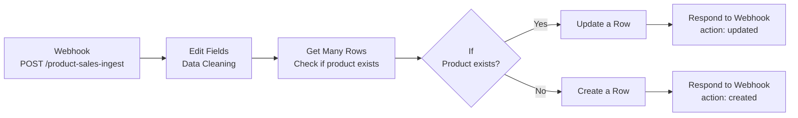

### Overview

| Field | Value |
|---|---|
| **Purpose** | Receives product and sales data from the frontend, cleans the input, then upserts (creates or updates) the product in the Supabase `Products` table. |
| **Called By** | React frontend -- `AddProductModal` and `CsvImportModal` components |
| **Trigger** | POST webhook at path `/product-sales-ingest` |
| **Response Mode** | `responseNode` -- the response is sent by a dedicated Respond to Webhook node, not automatically |
| **Tables Used** | `Products` (getAll, create, update) |

### Node-by-Node Documentation

#### Node 1: Webhook (Trigger)

| Property | Value |
|---|---|
| **Type** | `n8n-nodes-base.webhook` |
| **HTTP Method** | `POST` |
| **Path** | `product-sales-ingest` |
| **Response Mode** | `responseNode` |

**Purpose:** This is the entry point of the workflow. It listens for HTTP POST requests sent by the React frontend whenever a store owner adds or updates a product. The webhook receives a JSON body containing product fields like `product_id`, `product_name`, `category`, `current_stock`, `avg_daily_sales`, `reorder_threshold`, and `unit_price`.

Because response mode is set to `responseNode`, the webhook does not automatically return a response -- instead, a downstream Respond to Webhook node sends the response after processing is complete. This ensures the frontend only receives confirmation after the database operation succeeds.

#### Node 2: Edit Fields (Data Cleaning)

| Property | Value |
|---|---|
| **Type** | `n8n-nodes-base.set` |
| **Operation** | Set field values from expressions |

**Purpose:** Normalizes and sanitizes the incoming product data before it reaches the database. This is a critical data quality step.

**Field Mappings:**

| Output Field | Expression | Type | Notes |
|---|---|---|---|
| `product_id` | `{{$json.body.product_id}}` | String | Business key (e.g., `TEA_001`) |
| `product_name` | `{{$json.body.product_name}}` | String | Human-readable name |
| `category` | `{{$json.body.category}}` | String | Product category |
| `current_stock` | `{{$json.body.current_stock}}` | Number | Auto-converts string to number |
| `avg_daily_sales` | `{{$json.body.avg_daily_sales}}` | Number | Rolling average daily units sold |
| `reorder_threshold` | `{{$json.body.reorder_threshold}}` | Number | Stock level that triggers alerts |
| `unit_price` | `{{$json.body.unit_price}}` | Number | Price per unit in INR |

**Why this matters:** The frontend may send numeric values as strings (especially from CSV imports). The Set node's type coercion ensures `current_stock`, `avg_daily_sales`, `reorder_threshold`, and `unit_price` are always proper numbers before insertion into PostgreSQL.

#### Node 3: Get Many Rows (Existence Check)

| Property | Value |
|---|---|
| **Type** | `n8n-nodes-base.supabase` |
| **Operation** | `getAll` |
| **Table** | `Products` |
| **Limit** | `1` |
| **Filter** | `product_id` equals `{{$json.product_id}}` |
| **Always Output Data** | `true` |

**Purpose:** Queries the Products table to check whether a product with the given `product_id` already exists. This determines whether the next step should be an UPDATE (product exists) or a CREATE (new product).

The `alwaysOutputData: true` setting is important -- it ensures the node always outputs an item even when no matching rows are found. Without this, the pipeline would stall on zero results.

#### Node 4: If (Branch Decision)

| Property | Value |
|---|---|
| **Type** | `n8n-nodes-base.if` |
| **Condition** | `$json.id` is **not empty** (string, notEmpty) |
| **Type Validation** | Loose |

**Purpose:** Branches the workflow into two paths:

- **True (output 0):** The query returned a row with a valid `id` field -- the product already exists. Route to the Update path.
- **False (output 1):** The query returned no row (or `id` is empty) -- this is a new product. Route to the Create path.

The loose type validation handles edge cases where Supabase might return `null`, `undefined`, or an empty string for the `id` field.

#### Node 5: Update a Row (Existing Product)

| Property | Value |
|---|---|
| **Type** | `n8n-nodes-base.supabase` |
| **Operation** | `update` |
| **Table** | `Products` |
| **Filter** | `product_id` equals `{{$json.product_id}}` |

**Fields Updated:**

| Column | Value Source |
|---|---|
| `product_name` | `Edit Fields (Data Cleaning)` node output |
| `category` | `Edit Fields (Data Cleaning)` node output |
| `current_stock` | `Edit Fields (Data Cleaning)` node output |
| `avg_daily_sales` | `Edit Fields (Data Cleaning)` node output |
| `reorder_threshold` | `Edit Fields (Data Cleaning)` node output |
| `unit_price` | `Edit Fields (Data Cleaning)` node output |

**Purpose:** Updates the existing product row with the new values. Note that the field values are explicitly referenced from the `Edit Fields (Data Cleaning)` node (not from the If node's output), ensuring the cleaned data is always used.

#### Node 6: Respond to Webhook (Update Confirmation)

| Property | Value |
|---|---|
| **Type** | `n8n-nodes-base.respondToWebhook` |
| **Response** | JSON |
| **HTTP Status** | `200` |

**Response Body:**
```json
{
  "status": "success",
  "action": "updated",
  "product_id": "{{product_id from Edit Fields}}"
}
```

**Purpose:** Sends a success response back to the frontend confirming the product was updated. The `action: "updated"` field lets the frontend display the appropriate toast message.

#### Node 7: Create a Row (New Product)

| Property | Value |
|---|---|
| **Type** | `n8n-nodes-base.supabase` |
| **Operation** | `create` |
| **Table** | `Products` |

**Fields Inserted:**

| Column | Value Source |
|---|---|
| `product_id` | `Edit Fields (Data Cleaning)` node output |
| `product_name` | `Edit Fields (Data Cleaning)` node output |
| `category` | `Edit Fields (Data Cleaning)` node output |
| `current_stock` | `Edit Fields (Data Cleaning)` node output |
| `avg_daily_sales` | `Edit Fields (Data Cleaning)` node output |
| `reorder_threshold` | `Edit Fields (Data Cleaning)` node output |
| `unit_price` | `Edit Fields (Data Cleaning)` node output |

**Purpose:** Inserts a brand new product row into the Products table. The `product_id` field is included here (unlike the Update path) because it serves as the business key for the new record. The database auto-generates the `id` (UUID primary key), `created_at`, and default values for `risk_level` (`UNKNOWN`), `unit` (`Pieces`), etc.

#### Node 8: Respond to Webhook1 (Create Confirmation)

| Property | Value |
|---|---|
| **Type** | `n8n-nodes-base.respondToWebhook` |
| **Response** | JSON |
| **HTTP Status** | `200` |

**Response Body:**
```json
{
  "status": "success",
  "action": "created",
  "product_id": "{{product_id from Edit Fields}}"
}
```

**Purpose:** Sends a success response back to the frontend confirming the product was created. The `action: "created"` field lets the frontend display the appropriate toast message.

### Data Flow Summary

```
Frontend POST request
    |
    v
Raw JSON body {product_id, product_name, category, current_stock, ...}
    |
    v  [Edit Fields - Data Cleaning]
Cleaned & typed data {product_id: string, current_stock: number, ...}
    |
    v  [Get Many Rows]
Query result: existing product row OR empty result
    |
    v  [If - exists?]
   / \
  v   v
UPDATE  CREATE
  |     |
  v     v
{status: "success", action: "updated"}  OR  {status: "success", action: "created"}
```

---

## 3. WF-02: Stockout Date Calculator

> **ID:** `JgDNR0tDWj0Z_DVfHB4Fo` | **Nodes:** 5 | **Trigger:** Sub-workflow / Manual

### Screenshot

> *Add a screenshot of WF-02 from the n8n editor here.*
>
> 

### Workflow Diagram

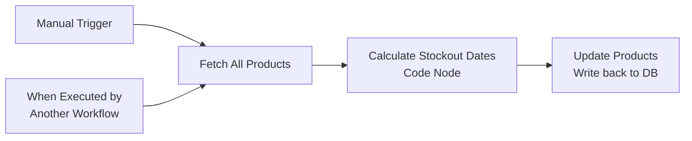

### Overview

| Field | Value |
|---|---|
| **Purpose** | Projects when each product will run out of stock based on current inventory levels and average daily sales velocity. |
| **Called By** | WF-08 Daily Orchestrator (as a sub-workflow) |
| **Triggers** | Manual execution OR `executeWorkflowTrigger` (sub-workflow call) |
| **Tables Used** | `Products` (getAll, update) |
| **Caller Policy** | `workflowsFromSameOwner` |

### Node-by-Node Documentation

#### Node 1: Manual Trigger

| Property | Value |
|---|---|
| **Type** | `n8n-nodes-base.manualTrigger` |

**Purpose:** Allows manual execution from the n8n editor for testing and debugging. Click "Execute workflow" in the n8n UI to run the stockout calculator independently of the daily pipeline.

#### Node 2: When Executed by Another Workflow

| Property | Value |
|---|---|
| **Type** | `n8n-nodes-base.executeWorkflowTrigger` |
| **Input Source** | `passthrough` |

**Purpose:** Sub-workflow entry point. When WF-08 calls this workflow via the Execute Workflow node, execution begins here. The `passthrough` input source means any data passed from the calling workflow is forwarded, though this workflow fetches its own data.

#### Node 3: Fetch All Products

| Property | Value |
|---|---|
| **Type** | `n8n-nodes-base.supabase` |
| **Operation** | `getAll` |
| **Table** | `Products` |
| **Return All** | `true` |

**Purpose:** Retrieves every product row from the Products table. The Code node needs `current_stock` and `avg_daily_sales` from each product to calculate stockout projections.

#### Node 4: Calculate Stockout Dates (Code Node)

| Property | Value |
|---|---|
| **Type** | `n8n-nodes-base.code` |
| **Language** | JavaScript |

**Purpose:** The core calculation engine. For each product, it computes two values:
- `days_to_stockout` -- how many days until the product runs out
- `estimated_stockout_date` -- the calendar date when stockout will occur

**Full Code:**

```javascript
const items = $input.all();
const today = new Date();

return items.map(item => {
  const p = item.json;
  const stock = parseFloat(p.current_stock) || 0;
  const sales = parseFloat(p.avg_daily_sales);

  let days;

  if (!sales || sales <= 0) {
    days = 999;                    // No sales data -> safe default (won't stockout)
  } else if (stock === 0) {
    days = 0;                      // Already out of stock
  } else {
    days = Math.floor(stock / sales);  // Integer division: units / units-per-day
  }

  const d = new Date(today);
  d.setDate(today.getDate() + days);
  const stockoutDate = d.toISOString().split('T')[0];  // Format: YYYY-MM-DD

  return {
    json: {
      product_id: p.product_id,
      days_to_stockout: days,
      estimated_stockout_date: stockoutDate
    }
  };
});
```

**Logic Walkthrough:**

| Step | Description |
|---|---|
| 1 | Get all product items from the previous node |
| 2 | For each product, parse `current_stock` and `avg_daily_sales` to floats |
| 3 | **Edge case -- no sales:** If `avg_daily_sales` is 0, null, or negative, set days to 999 (safe default meaning the product effectively never runs out) |
| 4 | **Edge case -- zero stock:** If `current_stock` is 0, set days to 0 (already out of stock) |
| 5 | **Normal case:** `days = floor(current_stock / avg_daily_sales)` -- integer division gives whole days remaining |
| 6 | Compute `estimated_stockout_date` by adding `days` to today's date |
| 7 | Format date as `YYYY-MM-DD` string for PostgreSQL DATE column |
| 8 | Return only the fields needed for the update: `product_id`, `days_to_stockout`, `estimated_stockout_date` |

**Example Calculations:**

| Product | Stock | Daily Sales | Days to Stockout | Stockout Date |
|---|---|---|---|---|
| Milk 500ml | 50 | 10 | 5 | 2026-03-20 |
| Tea Powder | 200 | 5 | 40 | 2026-04-24 |
| Sugar 1kg | 0 | 8 | 0 | 2026-03-15 |
| Premium Ghee | 30 | 0 | 999 | 2028-12-08 |

#### Node 5: Update Products

| Property | Value |
|---|---|
| **Type** | `n8n-nodes-base.supabase` |
| **Operation** | `update` |
| **Table** | `Products` |
| **Filter** | `product_id` equals `{{ $json.product_id }}` |

**Fields Updated:**

| Column | Value |
|---|---|
| `days_to_stockout` | `{{ $json.days_to_stockout }}` |
| `estimated_stockout_date` | `{{ $json.estimated_stockout_date }}` |

**Purpose:** Writes the calculated values back to each product row. These values are then used by WF-04 (risk classification) and displayed on the frontend dashboard.

---

## 4. WF-03: Inventory Processing & Stock Alerts

> **ID:** `P_JZINAHgGw-IVQOjI4eg` | **Nodes:** 7 | **Trigger:** Sub-workflow / Manual

### Screenshot

> *Add a screenshot of WF-03 from the n8n editor here.*
>
> 

### Workflow Diagram

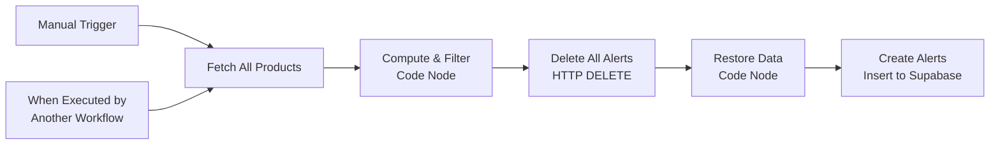

### Overview

| Field | Value |
|---|---|
| **Purpose** | Identifies products with dangerously low stock levels and generates active alerts for the dashboard and WhatsApp notifications. |
| **Called By** | WF-08 Daily Orchestrator (as a sub-workflow) |
| **Triggers** | Manual execution OR `executeWorkflowTrigger` (sub-workflow call) |
| **Tables Used** | `Products` (getAll), `Stock Alerts` (delete via HTTP, create via Supabase) |
| **Strategy** | Full-refresh: delete ALL existing alerts, then recreate only the currently valid ones |

### Node-by-Node Documentation

#### Node 1: When clicking 'Execute workflow' (Manual Trigger)

| Property | Value |
|---|---|
| **Type** | `n8n-nodes-base.manualTrigger` |

**Purpose:** Manual entry point for testing. Allows running the inventory processor independently of the daily pipeline.

#### Node 2: When Executed by Another Workflow

| Property | Value |
|---|---|
| **Type** | `n8n-nodes-base.executeWorkflowTrigger` |
| **Input Source** | `passthrough` |

**Purpose:** Sub-workflow entry point called by WF-08 during the daily pipeline. Both triggers connect to the same downstream node (Fetch All Products).

#### Node 3: Fetch All Products

| Property | Value |
|---|---|
| **Type** | `n8n-nodes-base.supabase` |
| **Operation** | `getAll` |
| **Table** | `Products` |
| **Return All** | `true` |

**Purpose:** Retrieves all product rows. The next Code node needs `current_stock` and `reorder_threshold` from each product to determine which ones need alerts.

#### Node 4: Compute & Filter (Code Node)

| Property | Value |
|---|---|
| **Type** | `n8n-nodes-base.code` |
| **Language** | JavaScript |

**Purpose:** The core alert generation logic. Filters products where stock has fallen to or below the reorder threshold, and builds alert objects for each.

**Full Code:**

```javascript
const now = new Date().toISOString();
const products = $input.all().map(i => i.json);

const alerts = products
  .filter(p => (parseInt(p.current_stock) || 0) <= (parseInt(p.reorder_threshold) || 0))
  .map(p => ({
    json: {
      product_id: String(p.product_id),
      product_name: String(p.product_name).trim(),
      alert_name: `Low Stock Alert: ${String(p.product_name).trim()}`,
      alert_date: now,
      current_stock: parseInt(p.current_stock) || 0,
      reorder_threshold: parseInt(p.reorder_threshold) || 0,
      alert_status: 'Active'
    }
  }));

if (alerts.length === 0) {
  return [{ json: { skip: true } }];
}

return alerts;
```

**Logic Walkthrough:**

| Step | Description |
|---|---|
| 1 | Get the current ISO timestamp for the `alert_date` field |
| 2 | Extract all products from the input |
| 3 | **Filter:** Keep only products where `current_stock <= reorder_threshold` |
| 4 | **Map:** For each low-stock product, build an alert object with: `product_id`, `product_name`, `alert_name` (formatted as "Low Stock Alert: {name}"), `alert_date`, `current_stock`, `reorder_threshold`, and `alert_status` set to "Active" |
| 5 | **Edge case:** If no products are below threshold, return `{ skip: true }` to signal downstream nodes that no alerts need to be created |
| 6 | All string values are explicitly cast and trimmed to prevent type issues |

#### Node 5: Delete All Alerts (HTTP Request)

| Property | Value |
|---|---|
| **Type** | `n8n-nodes-base.httpRequest` |
| **Method** | `DELETE` |
| **URL** | `https://xixdkapttirdedoivskx.supabase.co/rest/v1/Stock%20Alerts?id=neq.00000000-0000-0000-0000-000000000000` |

**Headers:**

| Header | Value |
|---|---|
| `apikey` | Supabase anon key |
| `Authorization` | `Bearer {supabase_anon_key}` |

**Purpose:** Deletes ALL existing rows from the Stock Alerts table using the Supabase REST API directly. The filter `id=neq.00000000-0000-0000-0000-000000000000` is a trick to match all rows (every real UUID is not equal to the zero UUID).

**Why HTTP instead of Supabase node?** The n8n Supabase node does not support bulk delete operations. A direct HTTP DELETE to the PostgREST API is the only way to clear the entire table.

**Why full-refresh?** The delete-and-recreate pattern ensures alerts always reflect the current state. If a product's stock was replenished and is no longer below threshold, its alert is automatically removed. No stale alerts persist.

#### Node 6: Restore Data (Code Node)

| Property | Value |
|---|---|
| **Type** | `n8n-nodes-base.code` |
| **Language** | JavaScript |

**Full Code:**

```javascript
return $('Compute & Filter').all();
```

**Purpose:** This is a critical pipeline repair node. The HTTP DELETE node (Node 5) replaces the pipeline data with its own response (HTTP status, headers, etc.), which destroys the alert objects computed in Node 4. This node restores the original alert data by referencing the output of the `Compute & Filter` node using n8n's `$()` function.

Without this node, the Create Alerts node would receive HTTP response data instead of alert objects, and the inserts would fail.

#### Node 7: Create Alerts

| Property | Value |
|---|---|
| **Type** | `n8n-nodes-base.supabase` |
| **Operation** | `create` |
| **Table** | `Stock Alerts` |

**Fields Inserted:**

| Column | Value |
|---|---|
| `product_id` | `{{ $json.product_id }}` |
| `product_name` | `{{ $json.product_name }}` |
| `alert_name` | `{{ $json.alert_name }}` |
| `alert_date` | `{{ $json.alert_date }}` |
| `current_stock` | `{{ $json.current_stock }}` |
| `reorder_threshold` | `{{ $json.reorder_threshold }}` |
| `alert_status` | `{{ $json.alert_status }}` |

**Purpose:** Inserts fresh alert rows into the Stock Alerts table for every product currently below its reorder threshold. Each item from the Compute & Filter node becomes one row. The Supabase node auto-generates `id`, `created_at`, and leaves `last_alerted_at` as NULL (will be set by WF-07 when WhatsApp notification is sent).

---

## 5. WF-04: Stock Risk Classification

> **ID:** `VkFbE0ZONeTximBLOw5Wx` | **Nodes:** 5 | **Trigger:** Sub-workflow / Manual

### Screenshot

> *Add a screenshot of WF-04 from the n8n editor here.*
>
> 

### Workflow Diagram

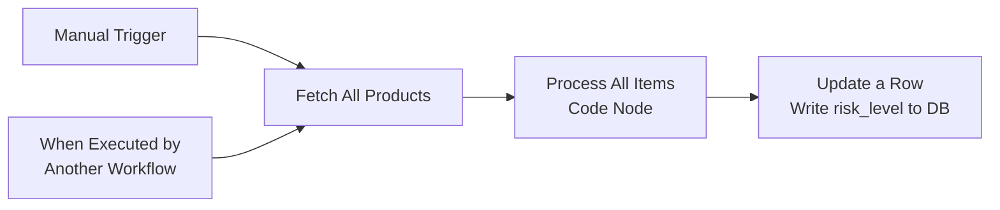

### Overview

| Field | Value |
|---|---|
| **Purpose** | Assigns a risk tier (HIGH / MEDIUM / LOW / UNKNOWN) to every product based on how many days of stock remain. |
| **Called By** | WF-08 Daily Orchestrator (after WF-02 completes) |
| **Depends On** | WF-02 -- needs `days_to_stockout` calculated first |
| **Triggers** | Manual execution OR `executeWorkflowTrigger` (sub-workflow call) |
| **Tables Used** | `Products` (getAll, update) |

### Risk Classification Tiers

| Risk Level | Condition | Meaning | Dashboard Color |
|---|---|---|---|
| **HIGH** | `days_to_stockout <= 3` | Critical -- reorder immediately | Red |
| **MEDIUM** | `days_to_stockout <= 7` | Warning -- plan reorder soon | Yellow / Orange |
| **LOW** | `days_to_stockout > 7` | Healthy stock level | Green |
| **UNKNOWN** | No data (null/undefined/empty) | Missing sales or stockout data | Gray |

### Node-by-Node Documentation

#### Node 1: When clicking 'Execute workflow' (Manual Trigger)

| Property | Value |
|---|---|
| **Type** | `n8n-nodes-base.manualTrigger` |

**Purpose:** Manual entry point for testing. Allows re-classifying all products independently.

#### Node 2: When Executed by Another Workflow

| Property | Value |
|---|---|
| **Type** | `n8n-nodes-base.executeWorkflowTrigger` |
| **Input Source** | `passthrough` |

**Purpose:** Sub-workflow entry point called by WF-08 after WF-02 has computed the `days_to_stockout` values.

#### Node 3: Fetch All Products

| Property | Value |
|---|---|
| **Type** | `n8n-nodes-base.supabase` |
| **Operation** | `getAll` |
| **Table** | `Products` |
| **Return All** | `true` |

**Purpose:** Retrieves all products. The Code node needs the `days_to_stockout` field (populated by WF-02) for classification.

#### Node 4: Process All Items (Code Node)

| Property | Value |
|---|---|
| **Type** | `n8n-nodes-base.code` |
| **Language** | JavaScript |

**Purpose:** Classifies each product into a risk tier based on its `days_to_stockout` value.

**Full Code:**

```javascript
const items = $input.all();

const classifiedItems = items.map(item => {
  const product = item.json;
  const days = product.days_to_stockout;

  let riskLevel = "UNKNOWN";

  if (days === null || days === undefined || days === "") {
    riskLevel = "UNKNOWN";
  } else if (days <= 3) {
    riskLevel = "HIGH";
  } else if (days <= 7) {
    riskLevel = "MEDIUM";
  } else {
    riskLevel = "LOW";
  }

  return {
    json: {
      product_id: product.product_id,
      risk_level: riskLevel
    }
  };
});

return classifiedItems;
```

**Logic Walkthrough:**

| Step | Description |
|---|---|
| 1 | Get all product items from the Fetch node |
| 2 | For each product, read `days_to_stockout` |
| 3 | **UNKNOWN:** If the value is `null`, `undefined`, or an empty string, classify as UNKNOWN (data is missing) |
| 4 | **HIGH:** If days <= 3, the product is critically low and needs immediate reordering |
| 5 | **MEDIUM:** If days is 4-7, the product is running low and reorder should be planned |
| 6 | **LOW:** If days > 7, the product has healthy stock levels |
| 7 | Return only `product_id` and `risk_level` for the update |

**Example Classifications:**

| Product | Days to Stockout | Risk Level |
|---|---|---|
| Milk 500ml | 2 | HIGH |
| Tea Powder | 5 | MEDIUM |
| Sugar 1kg | 15 | LOW |
| Premium Ghee | null | UNKNOWN |

#### Node 5: Update a Row

| Property | Value |
|---|---|
| **Type** | `n8n-nodes-base.supabase` |
| **Operation** | `update` |
| **Table** | `Products` |
| **Filter** | `product_id` equals `{{ $json.product_id }}` |

**Fields Updated:**

| Column | Value |
|---|---|
| `risk_level` | `{{ $json.risk_level }}` |

**Purpose:** Writes the computed risk level back to each product row. This value powers the frontend dashboard's risk badges, the color-coded product list, and is used by WF-05 to determine which products need AI reorder suggestions.

---

## 6. WF-05: AI Reorder Intelligence

> **ID:** `ivm5yQJMfSZn0VrNt40RB` | **Nodes:** 11 | **Trigger:** Sub-workflow / Manual

### Screenshot

> *Add a screenshot of WF-05 from the n8n editor here.*
>
> 

### Workflow Diagram

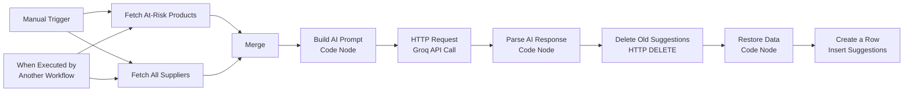

### Overview

| Field | Value |
|---|---|
| **Purpose** | Uses LLM intelligence to generate smart reorder recommendations for at-risk products, considering supplier reliability, pricing, and delivery speed. |
| **Called By** | WF-08 Daily Orchestrator (after WF-04 completes) |
| **Depends On** | WF-04 -- needs `risk_level` classified first |
| **Triggers** | Manual execution OR `executeWorkflowTrigger` (sub-workflow call) |
| **Tables Used** | `Products` (getAll with filter), `Suppliers` (getAll), `Reorder Suggestions` (delete via HTTP, create) |
| **External API** | Groq -- `https://api.groq.com/openai/v1/chat/completions` |
| **AI Model** | `llama-3.1-8b-instant` |
| **Strategy** | Full-refresh: delete all old suggestions, insert fresh AI-generated ones |

### Node-by-Node Documentation

#### Node 1: Manual Trigger

| Property | Value |
|---|---|
| **Type** | `n8n-nodes-base.manualTrigger` |

**Purpose:** Manual entry point for testing. Triggers both Fetch nodes in parallel.

#### Node 2: When Executed by Another Workflow

| Property | Value |
|---|---|
| **Type** | `n8n-nodes-base.executeWorkflowTrigger` |
| **Input Source** | `passthrough` |

**Purpose:** Sub-workflow entry point called by WF-08 after WF-04 completes risk classification. Also triggers both Fetch nodes in parallel.

#### Node 3: Fetch At-Risk Products

| Property | Value |
|---|---|
| **Type** | `n8n-nodes-base.supabase` |
| **Operation** | `getAll` |
| **Table** | `Products` |
| **Return All** | `true` |
| **Filter** | `risk_level` not equal to `LOW` |

**Purpose:** Fetches only the products that are not healthy -- those with HIGH, MEDIUM, or UNKNOWN risk levels. These are the products that may need reordering. LOW-risk products are excluded to keep the AI prompt focused.

#### Node 4: Fetch All Suppliers

| Property | Value |
|---|---|
| **Type** | `n8n-nodes-base.supabase` |
| **Operation** | `getAll` |
| **Table** | `Suppliers` |
| **Return All** | `true` |

**Purpose:** Retrieves all supplier records including their grades, reliability scores, delivery times, and category coverage. This data is included in the AI prompt so the LLM can make informed supplier recommendations.

#### Node 5: Merge

| Property | Value |
|---|---|
| **Type** | `n8n-nodes-base.merge` |
| **Mode** | Default (append) |

**Purpose:** Combines the outputs of both Fetch nodes into a single data stream. The default merge mode appends the items from input 1 (suppliers) after input 0 (products). The downstream Code node uses `$()` references to access each source independently.

#### Node 6: Build AI Prompt (Code Node)

| Property | Value |
|---|---|
| **Type** | `n8n-nodes-base.code` |
| **Language** | JavaScript |

**Purpose:** Constructs a detailed, structured prompt for the Groq LLM containing product inventory data, supplier profiles, and instructions for generating reorder recommendations.

**Full Code:**

```javascript
const products = $('Fetch At-Risk Products').all().map(i => i.json);
const suppliers = $('Fetch All Suppliers').all().map(i => i.json);

const atRisk = products.filter(p =>
  p.risk_level === 'HIGH' || p.risk_level === 'MEDIUM' || p.days_to_stockout <= 7
);

if (atRisk.length === 0) {
  return [{ json: { skip: true, message: 'No at-risk products found' } }];
}

const productLines = atRisk.map(p =>
  `- product_id: ${p.product_id} | name: ${p.product_name} | category: ${p.category || 'General'}` +
  ` | stock: ${p.current_stock} | daily_sales: ${p.avg_daily_sales}` +
  ` | days_left: ${p.days_to_stockout} | risk: ${p.risk_level}`
).join('\n');

const supplierLines = suppliers.map(s =>
  `- supplier_id: ${s.supplier_id} | name: ${s.supplier_name} | grade: ${s.supplier_grade}` +
  ` | delivers_in: ${s.delivery_time_days} days | supplies: ${s.supplies_categories}`
).join('\n');

const prompt = `You are an inventory manager for a small Indian kirana store.

AT-RISK PRODUCTS:
${productLines}

AVAILABLE SUPPLIERS:
${supplierLines}

For each at-risk product, generate a reorder suggestion. Use the exact product_id and
supplier_id from the data above. Pick the best supplier based on grade and whether they
supply that product category. Order quantity = 30 x daily_sales.

Respond ONLY with a valid JSON array. No explanation. No markdown. No code fences.
Format: [{"product_id":"TEA_001","supplier_id":"SUP_001","suggested_quantity":90,
"reason":"One sentence."}]`;

const requestBody = JSON.stringify({
  model: "llama-3.1-8b-instant",
  max_tokens: 1000,
  temperature: 0.3,
  messages: [{ role: "user", content: prompt }]
});

return [{ json: { requestBody, atRisk, suppliers } }];
```

**Logic Walkthrough:**

| Step | Description |
|---|---|
| 1 | Fetch products and suppliers from their respective source nodes using `$()` |
| 2 | Double-filter products: keep HIGH, MEDIUM, or any with `days_to_stockout <= 7` |
| 3 | **Skip check:** If no at-risk products, return `{ skip: true }` to bypass the API call |
| 4 | Format each product as a structured text line with all relevant metrics |
| 5 | Format each supplier as a structured text line with grade, delivery time, and categories |
| 6 | Build the LLM prompt with: role context (kirana store manager), product data, supplier data, and strict output format instructions |
| 7 | Build the Groq API request body with model `llama-3.1-8b-instant`, `temperature: 0.3` (low for deterministic output), and `max_tokens: 1000` |
| 8 | Pass the request body AND the original data (atRisk, suppliers) downstream for use in parsing |

**Prompt Engineering Notes:**
- The prompt explicitly instructs the LLM to use exact `product_id` and `supplier_id` values from the data to prevent hallucination
- `temperature: 0.3` keeps output deterministic and structured
- The formula `30 x daily_sales` gives a 30-day supply recommendation
- The "no markdown, no code fences" instruction prevents formatting that would break JSON parsing

#### Node 7: HTTP Request (Groq API Call)

| Property | Value |
|---|---|
| **Type** | `n8n-nodes-base.httpRequest` |
| **Method** | `POST` |
| **URL** | `https://api.groq.com/openai/v1/chat/completions` |

**Headers:**

| Header | Value |
|---|---|
| `Authorization` | `Bearer {groq_api_key}` |
| `Content-Type` | `application/json` |

**Body:** `{{ $json.requestBody }}` (the JSON string built by the previous Code node)

**Purpose:** Sends the constructed prompt to the Groq API. Groq provides ultra-fast inference for the Llama 3.1 8B Instant model. The response contains a `choices[0].message.content` field with the LLM's JSON array of reorder suggestions.

#### Node 8: Code in JavaScript (Parse AI Response)

| Property | Value |
|---|---|
| **Type** | `n8n-nodes-base.code` |
| **Language** | JavaScript |

**Purpose:** Parses the LLM's JSON response into individual reorder suggestion objects. Includes robust error handling with a fallback algorithm.

**Full Code:**

```javascript
const response = $input.first().json;
const context = $('Build AI Prompt').first().json;

if (context.skip) {
  return [{ json: { message: context.message, saved: 0 } }];
}

const atRisk    = context.atRisk;
const suppliers = context.suppliers;

// Build a map of product_name -> product_id for fixing AI response
const nameToId = {};
atRisk.forEach(p => {
  nameToId[p.product_name.toLowerCase()] = p.product_id;
});

let suggestions = [];
try {
  const content = response.choices[0].message.content;
  const cleaned = content.trim()
    .replace(/^```json\n?/, '')    // Remove markdown code fences if LLM ignores instructions
    .replace(/^```\n?/, '')
    .replace(/\n?```$/, '');
  suggestions = JSON.parse(cleaned);
} catch(e) {
  // FALLBACK: If AI response can't be parsed, generate rule-based suggestions
  console.log('AI parse failed, using fallback:', e.message);
  suggestions = atRisk.map(p => {
    const cat = (p.category || '').toLowerCase();
    const best = suppliers
      .filter(s => s.supplies_categories && s.supplies_categories.toLowerCase().includes(cat))
      .sort((a,b) => (b.composite_score||0) - (a.composite_score||0))[0]
      || suppliers[0];
    return {
      product_id: p.product_id,
      supplier_id: best.supplier_id,
      suggested_quantity: Math.ceil((p.avg_daily_sales || 1) * 30),
      reason: `Stock critically low (${p.days_to_stockout} days remaining). Ordering 30-day supply.`
    };
  });
}

const now = new Date().toISOString();

return suggestions.map(s => {
  // Fix: if AI returned product_name instead of product_id, convert it
  let pid = s.product_id;
  if (pid && !pid.includes('_')) {
    const fixed = nameToId[pid.toLowerCase()];
    if (fixed) pid = fixed;
  }

  return {
    json: {
      product_id:         pid,
      supplier_id:        s.supplier_id,
      suggested_quantity:  s.suggested_quantity,
      reason:             s.reason,
      status:             'Pending',
      ai_generated:       true,
      suggestion_date:    now
    }
  };
});
```

**Logic Walkthrough:**

| Step | Description |
|---|---|
| 1 | Get the HTTP response and the original context (atRisk products + suppliers) |
| 2 | **Skip check:** If there were no at-risk products, return early |
| 3 | Build a `nameToId` lookup map to fix cases where the LLM returns product names instead of IDs |
| 4 | **Try:** Extract `choices[0].message.content` from the Groq response, strip any markdown code fences, and parse as JSON |
| 5 | **Catch (fallback):** If JSON parsing fails, generate rule-based suggestions: find the best supplier for each product's category (sorted by composite_score), calculate `30 * avg_daily_sales` as the order quantity |
| 6 | **ID correction:** For each suggestion, check if the `product_id` looks like a name (no underscore). If so, look it up in the `nameToId` map and replace it |
| 7 | Add metadata fields: `status: 'Pending'`, `ai_generated: true`, `suggestion_date: now` |

**Fallback Strategy:** The fallback ensures the system always produces suggestions even when the LLM returns malformed output. It uses category matching and supplier scores to generate reasonable recommendations.

#### Node 9: HTTP Request1 (Delete Old Suggestions)

| Property | Value |
|---|---|
| **Type** | `n8n-nodes-base.httpRequest` |
| **Method** | `DELETE` |
| **URL** | `https://xixdkapttirdedoivskx.supabase.co/rest/v1/Reorder%20Suggestions?id=neq.00000000-0000-0000-0000-000000000000` |

**Headers:**

| Header | Value |
|---|---|
| `apikey` | Supabase anon key |
| `Authorization` | `Bearer {supabase_anon_key}` |

**Purpose:** Deletes all existing reorder suggestions using the same full-refresh pattern as WF-03. The filter matches all rows (every real UUID != zero UUID). Old suggestions are cleared to make way for fresh AI-generated ones.

#### Node 10: Restore Data (Code Node)

| Property | Value |
|---|---|
| **Type** | `n8n-nodes-base.code` |
| **Language** | JavaScript |

**Full Code:**

```javascript
return $('Code in JavaScript').all();
```

**Purpose:** Same pattern as WF-03. Restores the parsed suggestion data after the HTTP DELETE replaces the pipeline data. References the output of the Parse AI Response node.

#### Node 11: Create a Row (Insert Suggestions)

| Property | Value |
|---|---|
| **Type** | `n8n-nodes-base.supabase` |
| **Operation** | `create` |
| **Table** | `Reorder Suggestions` |

**Fields Inserted:**

| Column | Value |
|---|---|
| `product_id` | `{{ $json.product_id }}` |
| `supplier_id` | `{{ $json.supplier_id }}` |
| `suggested_quantity` | `{{ $json.suggested_quantity }}` |
| `reason` | `{{ $json.reason }}` |
| `status` | `{{ $json.status }}` |
| `ai_generated` | `{{ $json.ai_generated }}` |
| `suggestion_date` | `{{ $json.suggestion_date }}` |

**Purpose:** Inserts each AI-generated reorder suggestion as a new row. The frontend Reorder page displays these with the AI reasoning and allows the store owner to approve or dismiss each one.

---

## 7. WF-06: Supplier Scoring

> **ID:** `WkRvETkpAySDKEAzPwRWi` | **Nodes:** 5 | **Trigger:** Sub-workflow / Manual

### Screenshot

> *Add a screenshot of WF-06 from the n8n editor here.*
>
> 

### Workflow Diagram

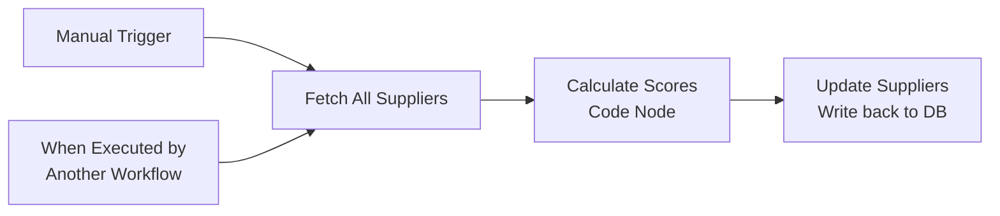

### Overview

| Field | Value |
|---|---|
| **Purpose** | Evaluates and ranks suppliers using a multi-criteria Weighted Sum Model (WSM) to help store owners identify the best suppliers for reordering. |
| **Called By** | Can be called by WF-08 or run independently |
| **Triggers** | Manual execution OR `executeWorkflowTrigger` (sub-workflow call) |
| **Tables Used** | `Suppliers` (getAll, update) |

### Scoring Formula

The Weighted Sum Model (WSM) combines three metrics:

| Metric | Weight | Scale | Source |
|---|---|---|---|
| Reliability Score | 40% | 0.0 -- 1.0 | `reliability_score` column |
| Price Competitiveness | 35% | 0.0 -- 1.0 | `price_score` column |
| Delivery Speed | 25% | 0.0 -- 1.0 (min-max normalized) | `delivery_time_days` column |

**Formula:** `composite_score = (reliability * 0.40 + price * 0.35 + delivery_normalized * 0.25) * 100`

**Delivery Normalization:** `delivery_score = 1 - ((days - min_days) / (max_days - min_days))`
- Fastest supplier gets score 1.0, slowest gets 0.0
- If all suppliers have the same delivery time, all get 1.0

### Grade Scale

| Grade | Score Range | Meaning |
|---|---|---|
| **A** | >= 80 | Excellent supplier |
| **B** | 65 -- 79 | Good supplier |
| **C** | 50 -- 64 | Average supplier |
| **D** | < 50 | Below average |

### Node-by-Node Documentation

#### Node 1: Manual Trigger

| Property | Value |
|---|---|
| **Type** | `n8n-nodes-base.manualTrigger` |

**Purpose:** Manual entry point for testing. Run to recalculate all supplier scores independently.

#### Node 2: When Executed by Another Workflow

| Property | Value |
|---|---|
| **Type** | `n8n-nodes-base.executeWorkflowTrigger` |
| **Input Source** | `passthrough` |

**Purpose:** Sub-workflow entry point. Can be called by WF-08 or other orchestration workflows.

#### Node 3: Fetch All Suppliers

| Property | Value |
|---|---|
| **Type** | `n8n-nodes-base.supabase` |
| **Operation** | `getAll` |
| **Table** | `Suppliers` |
| **Return All** | `true` |

**Purpose:** Retrieves all supplier records. Needs `reliability_score`, `price_score`, and `delivery_time_days` for the scoring calculation.

#### Node 4: Calculate Scores (Code Node)

| Property | Value |
|---|---|
| **Type** | `n8n-nodes-base.code` |
| **Language** | JavaScript |

**Full Code:**

```javascript
const items = $input.all();
const suppliers = items.map(i => i.json);

// Step 1: Find min and max delivery days for normalization
const deliveryDays = suppliers.map(s => parseInt(s.delivery_time_days) || 3);
const minDays = Math.min(...deliveryDays);
const maxDays = Math.max(...deliveryDays);

return suppliers.map(supplier => {
  const reliability = parseFloat(supplier.reliability_score) || 0;
  const price       = parseFloat(supplier.price_score) || 0;
  const days        = parseInt(supplier.delivery_time_days) || 3;

  // Min-Max normalize delivery time (1 = fastest, 0 = slowest)
  const deliveryScore = (maxDays === minDays)
    ? 1
    : 1 - ((days - minDays) / (maxDays - minDays));

  // Weighted Sum Model
  const composite = (
    (reliability * 0.40) +
    (price       * 0.35) +
    (deliveryScore * 0.25)
  ) * 100;

  const rounded = Math.round(composite * 10) / 10;

  // Grade assignment
  const grade = rounded >= 80 ? 'A'
              : rounded >= 65 ? 'B'
              : rounded >= 50 ? 'C'
              : 'D';

  // Human-readable breakdown
  const breakdown = `Reliability: ${Math.round(reliability*40)}pts` +
    ` | Price: ${Math.round(price*35)}pts` +
    ` | Speed: ${Math.round(deliveryScore*25)}pts`;

  return {
    json: {
      supplier_id:     supplier.supplier_id,
      composite_score: rounded,
      supplier_grade:  grade,
      score_breakdown: breakdown
    }
  };
});
```

**Logic Walkthrough:**

| Step | Description |
|---|---|
| 1 | Collect all delivery times and find the min/max for normalization |
| 2 | For each supplier, parse the three input metrics |
| 3 | **Normalize delivery:** Convert days to a 0-1 scale where faster = higher score |
| 4 | **WSM calculation:** Apply weights (40/35/25) and multiply by 100 for a 0-100 scale |
| 5 | Round to 1 decimal place |
| 6 | **Grade:** Map score to letter grade (A/B/C/D) |
| 7 | **Breakdown string:** Generate a human-readable point breakdown for display |

**Example Scoring:**

| Supplier | Reliability (0-1) | Price (0-1) | Delivery (days) | Delivery Norm | Composite | Grade |
|---|---|---|---|---|---|---|
| Fresh Foods Ltd | 0.9 | 0.8 | 2 | 1.0 | 89.0 | A |
| Quick Supply Co | 0.7 | 0.6 | 3 | 0.67 | 65.7 | B |
| Budget Traders | 0.5 | 0.9 | 5 | 0.0 | 51.5 | C |

#### Node 5: Update Suppliers

| Property | Value |
|---|---|
| **Type** | `n8n-nodes-base.supabase` |
| **Operation** | `update` |
| **Table** | `Suppliers` |
| **Filter** | `supplier_id` equals `{{ $json.supplier_id }}` |

**Fields Updated:**

| Column | Value |
|---|---|
| `composite_score` | `{{ $json.composite_score }}` |
| `supplier_grade` | `{{ $json.supplier_grade }}` |
| `score_breakdown` | `{{ $json.score_breakdown }}` |

**Purpose:** Writes the computed scores, grades, and breakdowns back to each supplier row. These values are used by WF-05 (AI Reorder) when selecting the best supplier and displayed on the frontend Suppliers page.

---

## 8. WF-07: WhatsApp Alert Sender

> **ID:** `C_-48mOxTzD9s-2H8UBT8` | **Nodes:** 6 | **Trigger:** POST Webhook / Sub-workflow

### Screenshot

> *Add a screenshot of WF-07 from the n8n editor here.*
>
> 

### Workflow Diagram

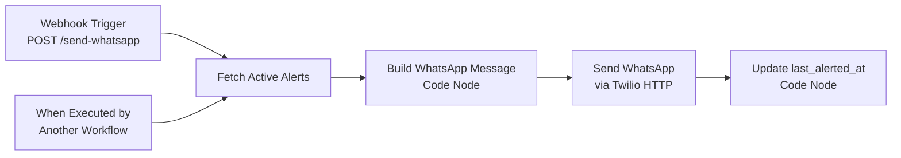

### Overview

| Field | Value |
|---|---|
| **Purpose** | Notifies the store owner via WhatsApp when products need urgent restocking attention. |
| **Called By** | WF-08 Daily Orchestrator (end of pipeline) or manually from frontend Settings page |
| **Triggers** | POST webhook at `/send-whatsapp` OR `executeWorkflowTrigger` |
| **Tables Used** | `Stock Alerts` (getAll with filter) |
| **External API** | Twilio WhatsApp Messaging API |
| **Anti-Spam** | 24-hour cooldown per alert |

### Node-by-Node Documentation

#### Node 1: Webhook Trigger

| Property | Value |
|---|---|
| **Type** | `n8n-nodes-base.webhook` |
| **HTTP Method** | `POST` |
| **Path** | `send-whatsapp` |

**Purpose:** HTTP entry point. The frontend Settings page has a "Send WhatsApp Alert" button that POSTs to this webhook, allowing manual alert sending outside the daily pipeline.

#### Node 2: When Executed by Another Workflow

| Property | Value |
|---|---|
| **Type** | `n8n-nodes-base.executeWorkflowTrigger` |
| **Input Source** | `passthrough` |

**Purpose:** Sub-workflow entry point called by WF-08 at the end of the daily pipeline after all analysis workflows complete.

#### Node 3: Fetch Active Alerts

| Property | Value |
|---|---|
| **Type** | `n8n-nodes-base.supabase` |
| **Operation** | `getAll` |
| **Table** | `Stock Alerts` |
| **Return All** | `true` |
| **Filter** | `alert_status` equals `Active` |

**Purpose:** Retrieves only active alerts (not dismissed ones). Returns product names, stock levels, and the `last_alerted_at` timestamp used for anti-spam filtering.

#### Node 4: Build WhatsApp Message (Code Node)

| Property | Value |
|---|---|
| **Type** | `n8n-nodes-base.code` |
| **Language** | JavaScript |

**Full Code:**

```javascript
const alerts = $input.all().map(i => i.json);

if (alerts.length === 0) {
  return [{ json: { skip: true, message: 'No active alerts' } }];
}

// Sort by urgency -- lowest stock first
alerts.sort((a, b) => (a.current_stock || 0) - (b.current_stock || 0));

// Anti-spam: filter out alerts sent within last 24 hours
const now = new Date();
const alertsToSend = alerts.filter(a => {
  if (!a.last_alerted_at) return true;
  const lastSent = new Date(a.last_alerted_at);
  const hoursSince = (now - lastSent) / (1000 * 60 * 60);
  return hoursSince >= 24;
});

if (alertsToSend.length === 0) {
  return [{ json: { skip: true, message: 'All alerts sent within last 24 hours' } }];
}

// Build message lines
const lines = alertsToSend.map(a => {
  if (a.current_stock === 0) {
    return `* ${a.product_name} -- OUT OF STOCK (0 units)`;
  }
  return `* ${a.product_name} -- ${a.current_stock} units left`;
});

const message = `*StockSense Alert*\n\n` +
  `${alertsToSend.length} product(s) need urgent attention:\n\n` +
  lines.join('\n') +
  `\n\nAI reorder suggestions are ready on your dashboard.`;

return [{
  json: {
    message,
    alertIds: alertsToSend.map(a => a.id),
    to: 'whatsapp:+917994596076',
    from: 'whatsapp:+12702798776'
  }
}];
```

**Logic Walkthrough:**

| Step | Description |
|---|---|
| 1 | **Empty check:** If no active alerts exist, return `skip: true` |
| 2 | **Sort:** Order alerts by `current_stock` ascending (most urgent / lowest stock first) |
| 3 | **Anti-spam filter:** For each alert, check `last_alerted_at`. If a notification was sent within the last 24 hours, exclude it. Alerts with no `last_alerted_at` (never sent) always pass |
| 4 | **Second empty check:** If all alerts were filtered by anti-spam, return `skip: true` |
| 5 | **Format:** Build WhatsApp-formatted message lines. Products with 0 stock get "OUT OF STOCK" label |
| 6 | **Compose:** Assemble the full message with header, count, product lines, and a call-to-action |
| 7 | Return the message, alert IDs (for timestamp update), and Twilio phone numbers |

#### Node 5: Send WhatsApp via Twilio (HTTP Request)

| Property | Value |
|---|---|
| **Type** | `n8n-nodes-base.httpRequest` |
| **Method** | `POST` |
| **URL** | `https://api.twilio.com/2010-04-01/Accounts/{account_sid}/Messages.json` |
| **Auth** | Twilio API credentials (predefined) |
| **Content-Type** | `application/x-www-form-urlencoded` |

**Body Parameters:**

| Parameter | Value |
|---|---|
| `To` | `{{ $json.to }}` (e.g., `whatsapp:+917994596076`) |
| `Body` | `{{ $json.message }}` |
| `From` | `whatsapp:+14155238886` (Twilio sandbox number) |

**Purpose:** Sends the formatted alert message to the store owner's WhatsApp number via the Twilio API. Uses form-urlencoded body format as required by Twilio's REST API.

#### Node 6: Update last_alerted_at (Code Node)

| Property | Value |
|---|---|
| **Type** | `n8n-nodes-base.code` |
| **Language** | JavaScript |

**Full Code:**

```javascript
const input = $('Build WhatsApp Message').first().json;

if (input.skip) {
  return [{ json: { message: input.message } }];
}

return input.alertIds.map(id => ({
  json: { id, last_alerted_at: new Date().toISOString() }
}));
```

**Purpose:** After a successful WhatsApp send, this node updates the `last_alerted_at` timestamp on each alert that was included in the notification. This timestamp powers the 24-hour anti-spam filter on subsequent runs, preventing the same alerts from being resent too frequently.

---

## 9. WF-08: Daily Orchestrator

> **ID:** `YGmf1h03MCjFVIMU3q0Zn` | **Nodes:** 21 | **Trigger:** Schedule (8 AM) / POST Webhook

### Screenshot

> *Add a screenshot of WF-08 from the n8n editor here.*
>
> 

### Workflow Diagram

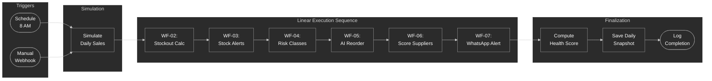

### Overview

| Field | Value |
|---|---|
| **Purpose** | Master daily orchestrator that runs the entire StockSense pipeline. Simulates stock depletion, then sequentially executes all analysis and notification workflows. |
| **Triggers** | Schedule Trigger (8 AM daily) OR POST webhook at `/run-pipeline` |
| **Sub-Workflows Called** | WF-02, WF-03, WF-04, WF-05, WF-07 |
| **Tables Used** | `Products` (getAll, update), `Stock Transactions` (create), `Daily Snapshots` (create), `System Logs` (create) |
| **Total Nodes** | 21 (including 4 collapse nodes for pipeline flow control) |

### Node-by-Node Documentation

#### Node 1: Schedule Trigger

| Property | Value |
|---|---|
| **Type** | `n8n-nodes-base.scheduleTrigger` |
| **Schedule** | Daily at 8:00 AM |

**Purpose:** The primary automated trigger. Every day at 8 AM, this node fires and starts the entire daily pipeline. This is how StockSense runs hands-free in production.

#### Node 2: Webhook Trigger

| Property | Value |
|---|---|
| **Type** | `n8n-nodes-base.webhook` |
| **HTTP Method** | `POST` |
| **Path** | `run-pipeline` |

**Purpose:** Manual on-demand trigger. The frontend Settings page has a "Run Pipeline Now" button that POSTs to this webhook, allowing the store owner to force a pipeline run outside the daily schedule.

#### Node 3: Fetch Products

| Property | Value |
|---|---|
| **Type** | `n8n-nodes-base.supabase` |
| **Operation** | `getAll` |
| **Table** | `Products` |
| **Return All** | `true` |

**Purpose:** Retrieves the complete product catalog. This is the starting dataset for the stock simulation step.

#### Node 4: Simulate Stock (Code Node)

| Property | Value |
|---|---|
| **Type** | `n8n-nodes-base.code` |
| **Language** | JavaScript |

**Purpose:** Simulates one day of sales by subtracting `avg_daily_sales` from `current_stock` for each product. Includes smart skip logic for manually updated products.

**Full Code:**

```javascript
const items = $input.all();
const now = new Date();
const cutoff = new Date(now - 24 * 60 * 60 * 1000);

return items
  .map(item => {
    const p = item.json;
    const lastUpdate = p.last_manual_update ? new Date(p.last_manual_update) : null;
    if (lastUpdate && lastUpdate > cutoff) return null;  // Skip recently updated
    const sales = parseFloat(p.avg_daily_sales) || 0;
    const stock = parseInt(p.current_stock) || 0;
    const new_stock = Math.max(0, stock - sales);
    return {
      json: {
        product_id: p.product_id,
        product_name: p.product_name,
        current_stock: Math.round(new_stock),
        quantity_change: -Math.min(sales, stock)
      }
    };
  })
  .filter(Boolean);
```

**Logic Walkthrough:**

| Step | Description |
|---|---|
| 1 | Calculate a 24-hour cutoff timestamp |
| 2 | For each product, check `last_manual_update` |
| 3 | **Skip logic:** If the product was manually updated within the last 24 hours, return `null` (skip it). This respects manual stock counts done by the store owner |
| 4 | Parse `avg_daily_sales` and `current_stock` to numbers |
| 5 | Compute `new_stock = max(0, current_stock - avg_daily_sales)` -- stock cannot go below zero |
| 6 | Track `quantity_change` as a negative number (representing sales outflow) |
| 7 | Filter out null entries (skipped products) |

#### Node 5: Update Stock

| Property | Value |
|---|---|
| **Type** | `n8n-nodes-base.supabase` |
| **Operation** | `update` |
| **Table** | `Products` |
| **Filter** | `product_id` equals `{{ $json.product_id }}` |

**Fields Updated:**

| Column | Value |
|---|---|
| `current_stock` | `{{ $json.current_stock }}` |

**Purpose:** Writes the simulated (reduced) stock levels back to the Products table.

#### Node 6: Merge (Collapse to Single Item)

| Property | Value |
|---|---|
| **Type** | `n8n-nodes-base.code` |
| **Execute Once** | `true` |

**Full Code:**

```javascript
return [{ json: { triggered_at: new Date().toISOString() } }];
```

**Purpose:** A critical flow-control node. After the Update Stock node processes multiple products (one item per product), this node collapses them into a single item. Sub-workflows triggered by Execute Workflow nodes expect a single trigger signal, not multiple items. Without this collapse, each product would trigger a separate sub-workflow execution.

#### Node 7: Run WF-02 (Stockout Date Calculator)

| Property | Value |
|---|---|
| **Type** | `n8n-nodes-base.executeWorkflow` |
| **Workflow ID** | `JgDNR0tDWj0Z_DVfHB4Fo` |
| **Wait for Completion** | `true` |

**Purpose:** Executes WF-02 as a sub-workflow and waits for it to finish. WF-02 recalculates `days_to_stockout` and `estimated_stockout_date` for all products based on the newly simulated stock levels.

#### Node 8: Collapse Node (Post WF-02)

| Property | Value |
|---|---|
| **Type** | `n8n-nodes-base.code` |
| **Execute Once** | `true` |

**Full Code:**

```javascript
return [{ json: { done: true } }];
```

**Purpose:** Collapses the output of WF-02 (which may return multiple items) into a single pass-through item for the next sub-workflow call. This pattern repeats between every sub-workflow execution.

#### Node 9: Run WF-03 (Inventory Processing & Stock Alerts)

| Property | Value |
|---|---|
| **Type** | `n8n-nodes-base.executeWorkflow` |
| **Workflow ID** | `P_JZINAHgGw-IVQOjI4eg` |
| **Wait for Completion** | `true` |

**Purpose:** Executes WF-03 which regenerates all Stock Alert records. After WF-02 updated the stockout projections, WF-03 uses the current stock levels to identify which products need alerts.

#### Node 10: Collapse Node1 (Post WF-03)

Same pattern as Node 8. Collapses output for the next sub-workflow.

#### Node 11: Run WF-04 (Stock Risk Classification)

| Property | Value |
|---|---|
| **Type** | `n8n-nodes-base.executeWorkflow` |
| **Workflow ID** | `VkFbE0ZONeTximBLOw5Wx` |
| **Wait for Completion** | `true` |

**Purpose:** Executes WF-04 which classifies every product into risk tiers (HIGH/MEDIUM/LOW/UNKNOWN) based on the `days_to_stockout` values that WF-02 just calculated.

#### Node 12: Collapse Node2 (Post WF-04)

Same pattern as Node 8. Collapses output for the next sub-workflow.

#### Node 13: Run WF-05 (AI Reorder Intelligence)

| Property | Value |
|---|---|
| **Type** | `n8n-nodes-base.executeWorkflow` |
| **Workflow ID** | `ivm5yQJMfSZn0VrNt40RB` |
| **Wait for Completion** | `true` |

**Purpose:** Executes WF-05 which calls the Groq LLM to generate AI-powered reorder suggestions for all at-risk products. This is the most compute-intensive step in the pipeline.

#### Node 14: Collapse Node3 (Post WF-05)

Same pattern as Node 8. Collapses output for the next sub-workflow.

#### Node 15: Run WF-07 WhatsApp (HTTP Request)

| Property | Value |
|---|---|
| **Type** | `n8n-nodes-base.httpRequest` |
| **Method** | `POST` |
| **URL** | `http://localhost:5678/webhook/send-whatsapp` |

**Purpose:** Triggers WF-07 by calling its webhook endpoint directly via HTTP POST (localhost since both workflows run on the same n8n instance). This sends low-stock WhatsApp notifications to the store owner.

**Note:** This uses an HTTP request to the webhook rather than an Execute Workflow node because WF-07 has both webhook and sub-workflow triggers, and the webhook path provides a simpler integration.

#### Node 16: Prepare Transactions (Code Node -- Parallel Branch)

| Property | Value |
|---|---|
| **Type** | `n8n-nodes-base.code` |
| **Language** | JavaScript |

**Purpose:** Builds Stock Transaction records for audit logging. This runs on a parallel branch from the Simulate Stock node (not on the main sub-workflow chain).

**Full Code:**

```javascript
const items = $input.all();
const now = new Date().toISOString();

return items.map(item => {
  const p = item.json;
  if (p.quantity_change === 0) return null;  // Skip zero-change products
  return {
    json: {
      product_id: p.product_id,
      product_name: p.product_name,
      transaction_type: 'sale',
      quantity_change: Math.round(p.quantity_change),
      new_stock_level: p.current_stock,
      notes: 'Daily pipeline simulated sales deduction'
    }
  };
}).filter(Boolean);
```

**Logic:** For each simulated sale, creates a transaction record with type `sale`, the negative quantity change, and the resulting stock level. Products with zero change (no sales) are skipped.

#### Node 17: Insert Transactions

| Property | Value |
|---|---|
| **Type** | `n8n-nodes-base.supabase` |
| **Operation** | `create` |
| **Table** | `Stock Transactions` |

**Fields Inserted:**

| Column | Value |
|---|---|
| `product_id` | `{{ $json.product_id }}` |
| `product_name` | `{{ $json.product_name }}` |
| `transaction_type` | `{{ $json.transaction_type }}` |
| `quantity_change` | `{{ $json.quantity_change }}` |
| `new_stock_level` | `{{ $json.new_stock_level }}` |
| `notes` | `{{ $json.notes }}` |

**Purpose:** Inserts the simulated sale transactions into the Stock Transactions table, providing an immutable audit trail of all stock changes. This powers the transaction history view on the frontend.

#### Node 18: Compute Snapshot (Code Node)

| Property | Value |
|---|---|
| **Type** | `n8n-nodes-base.code` |
| **Language** | JavaScript |

**Purpose:** After the entire pipeline completes, computes a daily health snapshot summarizing the state of the inventory.

**Full Code:**

```javascript
const products = $('Fetch Products').all().map(i => i.json);
const total = products.length;

const simulated = $('Simulate Stock').all().map(i => i.json);

let oos = 0, high = 0, medium = 0, low = 0;

simulated.forEach(s => {
  if (s.current_stock === 0) oos++;
  const orig = products.find(p => p.product_id === s.product_id);
  if (orig) {
    const risk = orig.risk_level || 'UNKNOWN';
    if (risk === 'HIGH') high++;
    else if (risk === 'MEDIUM') medium++;
    else if (risk === 'LOW') low++;
  }
});

// Health score formula: penalize based on problem severity
const problemScore = (high * 15 + medium * 5 + oos * 25);
const maxScore = total * 25;
const health = maxScore > 0
  ? Math.round(Math.max(0, 100 - (problemScore / maxScore * 100)))
  : 100;

const today = new Date().toISOString().split('T')[0];

return [{
  json: {
    snapshot_date: today,
    health_score: health,
    total_products: total,
    oos_count: oos,
    high_count: high,
    medium_count: medium,
    low_count: low,
    alerts_active: 0,
    suggestions_pending: 0
  }
}];
```

**Health Score Formula:**

```
problemScore = (HIGH_count * 15) + (MEDIUM_count * 5) + (OOS_count * 25)
maxScore     = total_products * 25
health_score = max(0, 100 - (problemScore / maxScore * 100))
```

| Condition | Penalty Weight | Rationale |
|---|---|---|
| Out of Stock (OOS) | 25 points | Most severe -- lost sales |
| HIGH risk | 15 points | Critical -- needs immediate action |
| MEDIUM risk | 5 points | Warning -- needs attention soon |
| LOW risk | 0 points | Healthy -- no penalty |

**Example:** 20 total products, 2 OOS, 3 HIGH, 4 MEDIUM:
- `problemScore = (3*15) + (4*5) + (2*25) = 45 + 20 + 50 = 115`
- `maxScore = 20 * 25 = 500`
- `health = 100 - (115/500 * 100) = 100 - 23 = 77`

#### Node 19: Save Snapshot

| Property | Value |
|---|---|
| **Type** | `n8n-nodes-base.supabase` |
| **Operation** | `create` |
| **Table** | `Daily Snapshots` |

**Fields Inserted:**

| Column | Value |
|---|---|
| `snapshot_date` | `{{ $json.snapshot_date }}` |
| `health_score` | `{{ $json.health_score }}` |
| `total_products` | `{{ $json.total_products }}` |
| `oos_count` | `{{ $json.oos_count }}` |
| `high_count` | `{{ $json.high_count }}` |
| `medium_count` | `{{ $json.medium_count }}` |
| `low_count` | `{{ $json.low_count }}` |
| `alerts_active` | `{{ $json.alerts_active }}` |
| `suggestions_pending` | `{{ $json.suggestions_pending }}` |

**Purpose:** Saves the daily snapshot to the database. This powers the frontend Reports page's health trend chart, showing how inventory health changes over time.

#### Node 20: Log Pipeline Run (Code Node)

| Property | Value |
|---|---|
| **Type** | `n8n-nodes-base.code` |
| **Language** | JavaScript |

**Full Code:**

```javascript
const products = $('Fetch Products').all().length;
const now = new Date().toISOString();

return [{
  json: {
    workflow_name: 'WF-08 Daily Orchestrator',
    status: 'success',
    records_processed: products,
    ran_at: now
  }
}];
```

**Purpose:** Prepares a System Log entry recording the successful pipeline execution with the workflow name, status, record count, and timestamp.

#### Node 21: Save Log

| Property | Value |
|---|---|
| **Type** | `n8n-nodes-base.supabase` |
| **Operation** | `create` |
| **Table** | `System Logs` |

**Fields Inserted:**

| Column | Value |
|---|---|
| `workflow_name` | `{{ $json.workflow_name }}` |
| `status` | `{{ $json.status }}` |
| `records_processed` | `{{ $json.records_processed }}` |
| `ran_at` | `{{ $json.ran_at }}` |

**Purpose:** Inserts the pipeline execution log into the System Logs table. This provides an audit trail of when the daily pipeline ran, how many records it processed, and whether it succeeded. The frontend System Logs page displays these entries.

### Parallel Branches

WF-08 has two parallel execution branches diverging from the Simulate Stock node:

| Branch | Path | Purpose |
|---|---|---|
| **Main branch** | Simulate Stock -> Update Stock -> Merge -> WF-02 -> ... -> Save Log | Core pipeline: update DB, run analytics, send alerts |
| **Transaction branch** | Simulate Stock -> Prepare Transactions -> Insert Transactions | Audit trail: log each simulated sale as a stock transaction |

Both branches execute independently. The main branch does not wait for the transaction branch to complete.

---

## 10. Cross-Workflow Dependencies

### Dependency Graph

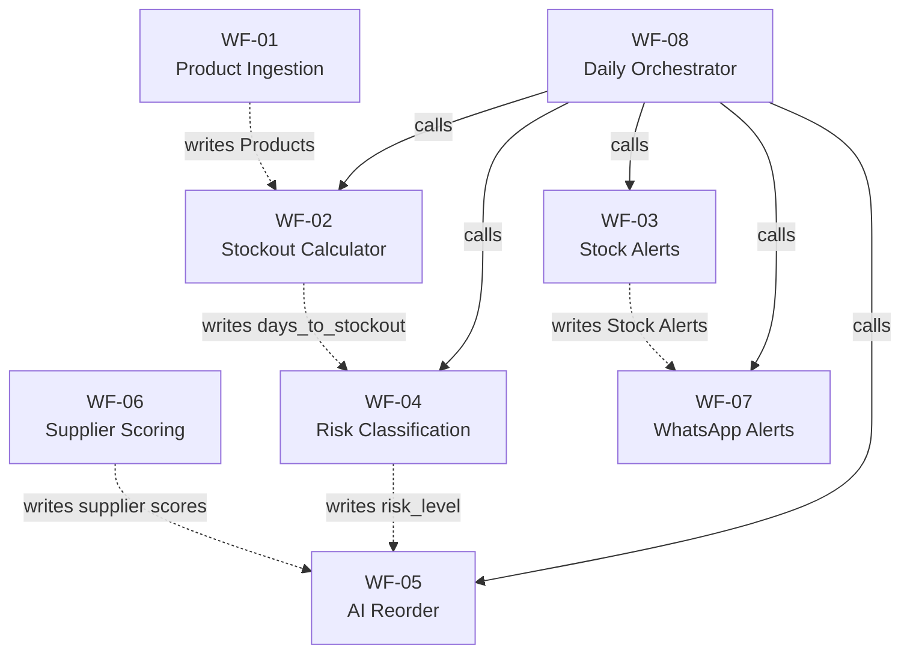

### Execution Order Constraints

| Order | Workflow | Depends On | Reason |
|---|---|---|---|
| 1 | WF-08 (Stock Simulation) | -- | Starting point: simulates daily sales |
| 2 | WF-02 | Stock simulation complete | Needs updated `current_stock` values |
| 3 | WF-03 | Stock simulation complete | Needs current stock vs threshold |
| 4 | WF-04 | WF-02 complete | Needs `days_to_stockout` for classification |
| 5 | WF-05 | WF-04 complete | Needs `risk_level` to filter at-risk products |
| 6 | WF-07 | WF-03 + WF-05 complete | Needs active alerts to send notifications |

**WF-01** and **WF-06** are independent -- they can run at any time outside the pipeline.

### Data Flow Between Workflows

| Source Workflow | Target Workflow | Data Passed | Via |
|---|---|---|---|
| WF-08 | WF-02 | Trigger signal | Execute Workflow node |
| WF-02 | WF-04 | `days_to_stockout` written to Products table | Shared database |
| WF-04 | WF-05 | `risk_level` written to Products table | Shared database |
| WF-06 | WF-05 | `composite_score`, `supplier_grade` in Suppliers table | Shared database |
| WF-03 | WF-07 | Alert records in Stock Alerts table | Shared database |
| WF-01 | All | Product records in Products table | Shared database |

**Key insight:** Sub-workflows do not pass data directly to each other via n8n's data pipeline. Instead, they communicate through the shared Supabase database. Each workflow reads the latest state from the DB when it starts.

---

## 11. Database Reference

### Tables Used by Workflows

#### Products

| Column | Type | Used By | Description |
|---|---|---|---|
| `id` | UUID (PK) | All | Auto-generated row ID |
| `product_id` | TEXT (unique) | All | Business key (e.g., `TEA_001`) |
| `product_name` | TEXT | WF-01, WF-03, WF-05, WF-08 | Human-readable name |
| `category` | TEXT | WF-05 | Product category for supplier matching |
| `current_stock` | INTEGER | WF-01, WF-02, WF-03, WF-08 | Current units in inventory |
| `avg_daily_sales` | NUMERIC | WF-01, WF-02, WF-08 | Rolling average daily sales |
| `reorder_threshold` | INTEGER | WF-01, WF-03 | Alert trigger level |
| `unit_price` | NUMERIC | WF-01 | Price per unit in INR |
| `days_to_stockout` | INTEGER | WF-02 (write), WF-04 (read) | Calculated days remaining |
| `estimated_stockout_date` | DATE | WF-02 (write) | Projected stockout date |
| `risk_level` | TEXT | WF-04 (write), WF-05 (read) | HIGH/MEDIUM/LOW/UNKNOWN |
| `last_manual_update` | TIMESTAMPTZ | WF-08 (read) | Skip simulation if recent |

#### Suppliers

| Column | Type | Used By | Description |
|---|---|---|---|
| `supplier_id` | TEXT (unique) | WF-05, WF-06 | Business key (e.g., `SUP_001`) |
| `supplier_name` | TEXT | WF-05, WF-06 | Supplier name |
| `reliability_score` | NUMERIC | WF-06 | 0.0-1.0 reliability rating |
| `price_score` | NUMERIC | WF-06 | 0.0-1.0 price competitiveness |
| `delivery_time_days` | INTEGER | WF-05, WF-06 | Delivery lead time |
| `composite_score` | NUMERIC | WF-06 (write), WF-05 (read) | WSM score 0-100 |
| `supplier_grade` | TEXT | WF-06 (write), WF-05 (read) | Letter grade A-D |
| `supplies_categories` | TEXT | WF-05 | Categories the supplier covers |

#### Stock Alerts

| Column | Type | Used By | Description |
|---|---|---|---|
| `product_id` | TEXT (FK) | WF-03 (write) | Product reference |
| `alert_name` | TEXT | WF-03 (write) | "Low Stock Alert: {name}" |
| `current_stock` | INTEGER | WF-03 (write), WF-07 (read) | Stock at alert time |
| `alert_status` | TEXT | WF-03 (write), WF-07 (filter) | Active / Dismissed |
| `last_alerted_at` | TIMESTAMPTZ | WF-07 (read/write) | Anti-spam timestamp |

#### Reorder Suggestions

| Column | Type | Used By | Description |
|---|---|---|---|
| `product_id` | TEXT | WF-05 (write) | Product reference |
| `supplier_id` | TEXT (FK) | WF-05 (write) | Recommended supplier |
| `suggested_quantity` | INTEGER | WF-05 (write) | Units to reorder |
| `reason` | TEXT | WF-05 (write) | AI-generated explanation |
| `status` | TEXT | WF-05 (write) | Pending / Approved / Dismissed |
| `ai_generated` | BOOLEAN | WF-05 (write) | Always `true` for pipeline |

#### Stock Transactions

| Column | Type | Used By | Description |
|---|---|---|---|
| `product_id` | TEXT | WF-08 (write) | Product reference |
| `transaction_type` | TEXT | WF-08 (write) | `sale` for simulated deductions |
| `quantity_change` | INTEGER | WF-08 (write) | Negative for sales |
| `new_stock_level` | INTEGER | WF-08 (write) | Stock after transaction |

#### Daily Snapshots

| Column | Type | Used By | Description |
|---|---|---|---|
| `snapshot_date` | DATE | WF-08 (write) | The date of the snapshot |
| `health_score` | NUMERIC | WF-08 (write) | 0-100 inventory health |
| `total_products` | INTEGER | WF-08 (write) | Total SKUs tracked |
| `oos_count` | INTEGER | WF-08 (write) | Out-of-stock count |
| `high_count` | INTEGER | WF-08 (write) | HIGH risk count |
| `medium_count` | INTEGER | WF-08 (write) | MEDIUM risk count |
| `low_count` | INTEGER | WF-08 (write) | LOW risk count |

#### System Logs

| Column | Type | Used By | Description |
|---|---|---|---|
| `workflow_name` | TEXT | WF-08 (write) | e.g., "WF-08 Daily Orchestrator" |
| `status` | TEXT | WF-08 (write) | success / error / warning |
| `records_processed` | INTEGER | WF-08 (write) | Product count |
| `ran_at` | TIMESTAMPTZ | WF-08 (write) | Execution timestamp |

---

## 12. Appendices

### A. Webhook Endpoints

| Endpoint | Method | Workflow | Purpose |
|---|---|---|---|
| `/webhook/product-sales-ingest` | POST | WF-01 | Ingest product/sales data from frontend |
| `/webhook/run-pipeline` | POST | WF-08 | Trigger daily pipeline on demand |
| `/webhook/send-whatsapp` | POST | WF-07 | Send WhatsApp stock alerts |

### B. External API Integrations

| Service | API Endpoint | Used By | Purpose |
|---|---|---|---|
| **Groq** | `https://api.groq.com/openai/v1/chat/completions` | WF-05 | LLM inference for reorder suggestions |
| **Twilio** | `https://api.twilio.com/2010-04-01/Accounts/{sid}/Messages.json` | WF-07 | WhatsApp message delivery |
| **Supabase REST** | `https://{project}.supabase.co/rest/v1/{table}` | WF-03, WF-05 | Bulk DELETE operations |

### C. Environment Variables

| Variable | Purpose | Used By |
|---|---|---|
| `VITE_SUPABASE_URL` | Supabase project URL | Frontend direct queries |
| `VITE_SUPABASE_ANON_KEY` | Supabase public API key | Frontend + WF-03, WF-05 (HTTP nodes) |
| `VITE_N8N_BASE_URL` | n8n instance URL | Frontend webhook calls |
| `VITE_N8N_API_KEY` | n8n API authentication | Frontend API triggers |

### D. Common Patterns

#### Full-Refresh Delete-and-Recreate

Used by WF-03 (Stock Alerts) and WF-05 (Reorder Suggestions):

```
1. Compute new data from source
2. HTTP DELETE all existing rows (via Supabase REST API)
3. Restore Data node (recover computed data lost by HTTP node)
4. Insert new rows via Supabase node
```

**Why?** Ensures data always reflects current state. Simpler than diffing old vs new records.

#### Collapse Node Pattern

Used by WF-08 between every sub-workflow execution:

```javascript
return [{ json: { done: true } }];
```

**Why?** Sub-workflows may return multiple items. The next Execute Workflow node expects a single trigger item. The collapse node normalizes the pipeline.

#### Skip Pattern

Used by WF-03, WF-05, and WF-07 Code nodes:

```javascript
if (noData) {
  return [{ json: { skip: true, message: 'Reason...' } }];
}
```

**Why?** Gracefully handles empty datasets. Downstream nodes can check for `skip: true` and avoid unnecessary processing or API calls.

### E. Adding Screenshots

To add real n8n editor screenshots to this document:

1. Open each workflow in the n8n editor
2. Take a screenshot of the full workflow canvas
3. Save screenshots to `docs/images/` with these filenames:
   - `wf-01-product-sales-ingestion.png`
   - `wf-02-stockout-date-calculator.png`
   - `wf-03-inventory-processing.png`
   - `wf-04-stock-risk-classification.png`
   - `wf-05-ai-reorder-intelligence.png`
   - `wf-06-supplier-scoring.png`
   - `wf-07-whatsapp-alert-sender.png`
   - `wf-08-daily-orchestrator.png`
4. The image references in this document will automatically resolve

---

*Document generated on March 15, 2026. For the latest workflow definitions, refer to the JSON files in the `backend/` directory.*
